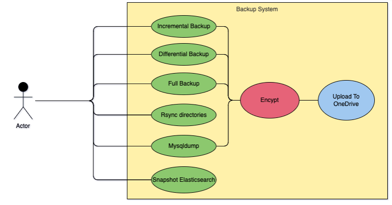
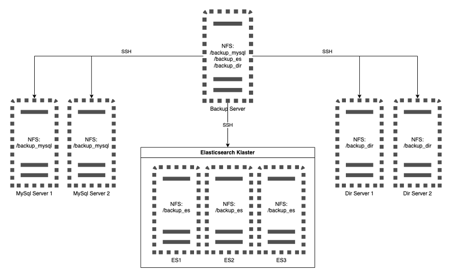
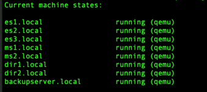
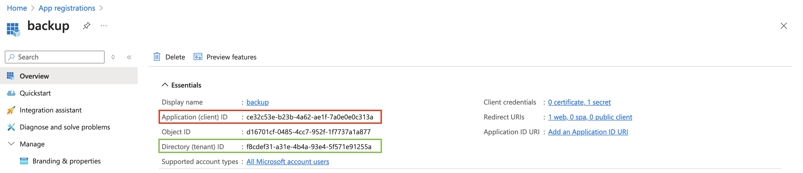
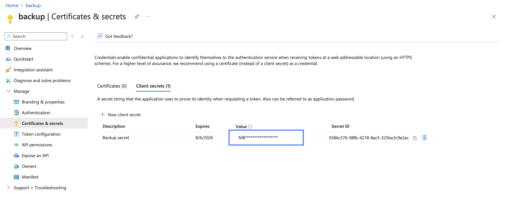

# Table of content

- [Backup system](#backup-system)
  - [UseCase diagram of backup system](#usecase-diagram-of-backup-system)
  - [Infrastructure of backup system](#Infrastructure-of-backup-system)
  - [Provisioning infrastructure with Vagrant](#Provisioning-infrastructure-with-Vagrant)
  - [Configure system](#configure-system)
  - [Install MySQl](#Install-MySQl)
  - [Configure NFS](#Configure-NFS)
  - [Install Elasticsearch](#Install-Elasticsearch)
  - [Prepare backup server](#Prepare-backup-server)
  - [Configure OneDrive](#Configure-OneDrive)
  - [All-in-one commands](#All-in-one-commands)


# Backup System
Backup system is capable of doing multiple things:
  - targz
  - rsync
  - mysqldump
  - snapshotting ES
  - upload to onedrive

### UseCase diagram of backup system



### Infrastructure of backup system



### Provisioning infrastructure with Vagrant
```
# install Vagrant using Homebrew
brew install vagrant qemu

# install required Vagrant plugins
vagrant plugin install vagrant-vbguest
vagrant plugin install vagrant-qemu
vagrant plugin install vagrant-libvirt

# change directory so the Vagrantfile is at .
vagrant up

# after that you should see 8 virtual machines running
```


### Configure system
```
# prepare hosts file
sudo ./update_hosts_file.sh

# skip fingerprint check
export ANSIBLE_HOST_KEY_CHECKING=false

# use ssh key without prompt for password
eval "$(ssh-agent -s)"
ssh-add

# using ansible playbook
ansible-playbook configure_system.yml -i hosts -u vagrant
```

### Install MySQl
```
# using ansible playbook
ansible-playbook install_mysql.yml -i hosts -u vagrant
```

### Configure NFS
```
# using ansible playbook
ansible-playbook configure_nfs.yml -i hosts -u vagrant
```

### Install Elasticsearch
```
# using ansible playbook
ansible-playbook install_elastic.yml -i hosts -u vagrant

# installation guide
# https://www.elastic.co/guide/en/elasticsearch/reference/current/rpm.html

# it is important to add path.repo to configuration
# path.repo: ["/data/bckup_es"]

# direcotry /data/backup_es shoult be mounted as NFS to the all nodes
# NFS server shoud be backup server
```

### Prepare backup server
```
# using ansible playbook
ansible-playbook install_backup_system.yml -i hosts -u vagrant
```

### Configure OneDrive
ClientID and TenantID can be found at Overview tab of your applicaiton:
NOTE: If you are using personal account, you must specify "common" for tenand_id in configuration


Client secret is the value of created secret:



### All-in-one commands
```
vagrant up
sudo ./update_hosts_file.sh
export ANSIBLE_HOST_KEY_CHECKING=false
eval "$(ssh-agent -s)"
ssh-add
ansible-playbook configure_system.yml -i hosts -u vagrant
ansible-playbook install_mysql.yml -i hosts -u vagrant
ansible-playbook configure_nfs.yml -i hosts -u vagrant
ansible-playbook install_elastic.yml -i hosts -u vagrant
ansible-playbook install_backup_system.yml -i hosts -u vagrant
```

# izmena
